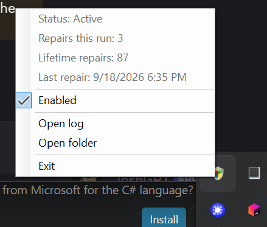

# AcerInputFix

A small Windows tray utility that works around an Acer keyboard issue where `VK_MEDIA_NEXT_TRACK` can remain held after a media-key press. The app watches the low-level keyboard stream, releases the key after 350 ms when no matching key-up arrives, and suppresses the resulting bogus repeat events.




## AI Disclaimer

This project was created after an Acer mainboard replacement exposed a keyboard issue that could make VS Code, PowerShell, the Windows key, and other input unreliable.

AI agents were used to investigate the issue through event logging and help assemble this workaround. It may be useful to others experiencing similar behavior.

## Requirements

- Windows 10 or later
- .NET 8 SDK
- A Windows desktop session, because the app installs a low-level keyboard hook

## Build and publish

From the repository root:

```powershell
dotnet publish -c Release -r win-x64 --self-contained true /p:PublishSingleFile=true
```

The published executable will be under:

```text
bin\Release\net8.0-windows\win-x64\publish\AcerInputFix.exe
```

Copy `AcerInputFix.exe` to the folder where you want it to live. The application writes `AcerInputFix.log` and `stats.json` beside the executable, so the folder must be writable by the signed-in user.

## Run

Start `AcerInputFix.exe`. It runs in the notification area and begins monitoring immediately. Right-click its tray icon to pause or resume the fix, open the log folder, or exit.

The utility is intentionally quiet when no stuck input is detected. A repair is recorded in the tray menu, log file, and lifetime `stats.json` counter.

When running **as Administrator**, each repair can also auto-cycle the Acer Col07 consumer-control device (disable/enable) to restore taskbar previews. Toggle **Auto-reset Col07 on repair** in the tray menu. Re-run `Install-StartupTask.ps1` so the logon task uses `RunLevel Highest`.

## Start with Windows

Place `AcerInputFix.exe` beside the PowerShell scripts, then run PowerShell as the signed-in user:

```powershell
Set-ExecutionPolicy -Scope Process Bypass
.\Install-StartupTask.ps1
```

This registers an interactive scheduled task that starts the utility when that user signs in. To remove it:

```powershell
.\Remove-StartupTask.ps1
```

The installer uses the executable next to `Install-StartupTask.ps1`; it does not require a fixed installation path.

## Layer-2 diagnostics

Optional logging for the remaining taskbar-preview investigation is documented in [DIAGNOSTICS.md](DIAGNOSTICS.md). Enable **Layer-2 diagnostics** from the tray menu; B0 quarantine/suppression is unchanged.

## Safety and limitations

- This is a Windows-only utility and is specific to the Acer input behavior described above.
- It uses a low-level keyboard hook and synthetic key-up input. Review the source before running it on a machine where keyboard input is security-sensitive.
- Only the `VK_MEDIA_NEXT_TRACK` path is modified. Other keyboard input is passed through.

## License

This is the `I don't care` license, I didn't write it, who knows where the AI got its knowledge from.
